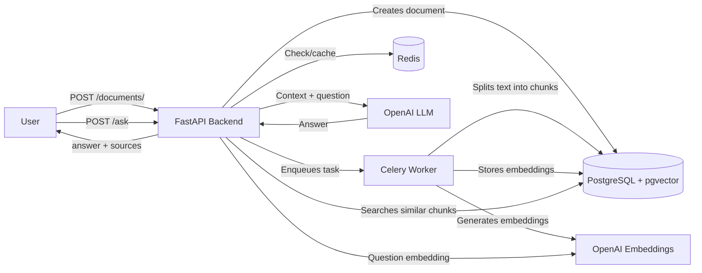
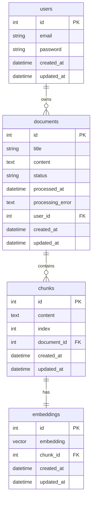

[English](README.md) | [Русский](README.ru.md)
# AI-Knowledge-Base-API (RAG)

## Description

AI-Knowledge-Base is a backend service for **Retrieval-Augmented Generation (RAG)**.  
The project allows you to:

- Upload documents via API
- Split text into chunks
- Generate vector embeddings via OpenAI
- Store embeddings in PostgreSQL with the `pgvector` extension
- Perform semantic search and generate LLM responses based on relevant text fragments

The project is built on **FastAPI + Celery + PostgreSQL + Redis**, with Docker support.

---

## Tech Stack

- **Backend:** FastAPI, SQLAlchemy, Pydantic, Celery
- **Database:** PostgreSQL + pgvector
- **Cache:** Redis
- **LLM/Embeddings:** OpenAI (`text-embedding-3-small`, `gpt-4o-mini`)
- **Docker:** backend, celery, postgres, redis
- **API docs:** Swagger `/docs`

---

## Features

- User registration and authentication via JWT
- Document upload via API
- Asynchronous document processing with Celery
- Text splitting into chunks
- Embedding generation via OpenAI
- Embedding storage in PostgreSQL with pgvector
- Semantic search across user documents
- LLM-based response generation using retrieved context
- Source attribution in responses
- Caching of embeddings and LLM responses via Redis

---

## Architecture

The project follows a layered architecture:

- `app/api/routers` — HTTP endpoints
- `app/schemas` — Pydantic request/response schemas
- `app/services` — business logic
- `app/repositories` — database operations
- `app/models` — SQLAlchemy models
- `app/tasks` — Celery worker for document processing
- `app/core` — configuration, Redis, Celery, security
- `app/db` — database connection

### System Workflow



### Document Ingestion Pipeline (Celery)

1. User creates a document via `/documents/`  
2. Celery task `process_document(document_id)` splits the document into chunks  
3. Embeddings are generated for each chunk  
4. Embeddings are stored in PostgreSQL  
5. Document is ready for search and RAG

---

## How RAG Works

RAG (Retrieval-Augmented Generation) consists of two stages:

1. **Retrieval** — searching for relevant chunks based on the question embedding
2. **Generation** — LLM formulates an answer based on the retrieved chunks

**Pipeline for `/ask`:**

- User sends a question → service creates an embedding  
- PostgreSQL + pgvector searches for similar chunks  
- Retrieved context is passed to the LLM  
- Response is returned with sources (`sources`)  
- Repeated requests to `/ask` are cached in Redis.  
This prevents calling the LLM again for identical questions and context, making subsequent requests significantly faster.

Running with Docker

1. Create `.env` file from `.env.example`:

```bash
cp .env.example .env
```

2. Build and start all services:
```bash
docker compose up --build
```

### Services:
- **backend** — FastAPI API on port 8000
- **postgres** — PostgreSQL database with pgvector
- **redis** — caching layer
- **celery** — document processing worker

3. Open Swagger API documentation:
```bash
http://localhost:8000/docs
```

## API Request Examples

### User Registration
```bash
curl -X POST http://localhost:8000/auth/register \
  -H "Content-Type: application/json" \
  -d '{"email":"demo@example.com","password":"password123"}'
```

### Login and Get Token
```bash
curl -X POST http://localhost:8000/auth/login \
  -H "Content-Type: application/x-www-form-urlencoded" \
  -d "username=demo@example.com&password=password123"
```

### Create Document
```bash
curl -X POST http://localhost:8000/documents/ \
  -H "Authorization: Bearer YOUR_ACCESS_TOKEN" \
  -H "Content-Type: application/json" \
  -d '{"title":"pgvector","content":"pgvector is a PostgreSQL extension for vector similarity search..."}'
```

### Ask a Question
```bash
curl -X POST http://localhost:8000/ask \
  -H "Authorization: Bearer YOUR_ACCESS_TOKEN" \
  -H "Content-Type: application/json" \
  -d '{"question":"What is pgvector used for?"}'
```

### Example Response
```json
{
  "answer": "pgvector is used for vector similarity search in PostgreSQL.",
  "sources": [
    {
      "chunk_id": 1,
      "document_id": 1,
      "content": "pgvector is a PostgreSQL extension for vector similarity search..."
    }
  ]
}
```

---

## ER Diagram

The core data model consists of four entities:

- `users` — system users
- `documents` — documents uploaded by users
- `chunks` — document fragments created after text splitting
- `embeddings` — vector representations of chunks for semantic search via pgvector

**Entity Relationships:**

- `users` → `documents`: one user can have many documents
- `documents` → `chunks`: one document is split into many chunks
- `chunks` → `embeddings`: one chunk has one embedding

The `users.password` field stores the password hash, not the plaintext password.



## Future Enhancements

- Add support for PDF, Markdown, and HTML file uploads
- Implement a dedicated ingestion service for external data sources
- Add synchronization with external knowledge base sources
- Create a frontend for document upload and response display
- Implement user query history
- Add comprehensive tests for the complete RAG pipeline
- Set up CI/CD for automated project validation

---

## License

This project is licensed under the MIT License. See the [LICENSE](LICENSE) file for details.

## Contact

- Email: danil.boghatov17@gmail.com  
- GitHub: [https://github.com/8-mile-code](https://github.com/8-mile-code)