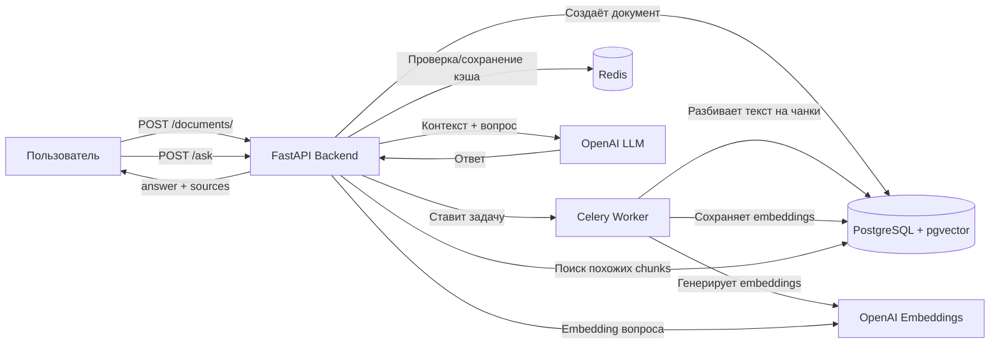
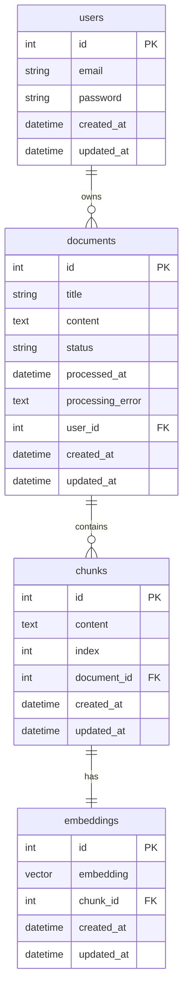

[English](README.md) | [Русский](README.ru.md)
# AI-Knowledge-Base-API (RAG)

## Описание

AI-Knowledge-Base — это backend-сервис для **Retrieval-Augmented Generation (RAG)**.  
Проект позволяет:

- Загружать документы через API
- Разбивать текст на чанки
- Генерировать векторные embeddings через OpenAI
- Хранить embeddings в PostgreSQL с расширением `pgvector`
- Выполнять семантический поиск и генерацию ответа LLM по релевантным фрагментам текста

Проект реализован на **FastAPI + Celery + PostgreSQL + Redis**, с поддержкой Docker.

---

## Стек технологий

- **Backend:** FastAPI, SQLAlchemy, Pydantic, Celery
- **Database:** PostgreSQL + pgvector
- **Cache:** Redis
- **LLM/Embeddings:** OpenAI (`text-embedding-3-small`, `gpt-4o-mini`)
- **Docker:** backend, celery, postgres, redis
- **API docs:** Swagger `/docs`

---

## Возможности

- Регистрация и авторизация пользователей через JWT
- Загрузка документов через API
- Асинхронная обработка документов через Celery
- Разбиение текста на чанки
- Генерация embeddings через OpenAI
- Хранение embeddings в PostgreSQL с pgvector
- Семантический поиск по документам пользователя
- Генерация ответов через LLM на основе найденного контекста
- Возврат источников, использованных для ответа
- Кэширование embeddings и LLM-ответов через Redis
---

## Архитектура

Проект построен по слоям:

- `app/api/routers` — HTTP endpoints
- `app/schemas` — Pydantic-схемы запросов и ответов
- `app/services` — бизнес-логика
- `app/repositories` — работа с БД
- `app/models` — SQLAlchemy-модели
- `app/tasks` — Celery worker для обработки документов
- `app/core` — конфигурация, Redis, Celery, security
- `app/db` — подключение к базе данных

### Общая схема работы



**Ingestion pipeline через Celery:**

1. Пользователь создаёт документ через `/documents/`  
2. Celery task `process_document(document_id)` разбивает документ на чанки  
3. Генерируются embeddings для каждого чанка  
4. Embeddings сохраняются в PostgreSQL  
5. Документ готов для поиска и RAG

---

## Как работает RAG

RAG (Retrieval-Augmented Generation) — это два этапа:

1. **Retrieval** — поиск релевантных чанков в базе по embedding вопроса
2. **Generation** — LLM формирует ответ на основе найденных чанков

Pipeline для `/ask`:

- Пользователь отправляет вопрос → сервис создаёт embedding  
- В PostgreSQL + pgvector ищутся похожие чанки  
- Сформированный контекст передаётся LLM  
- Ответ возвращается вместе с источниками (`sources`)  
- Повторные запросы к `/ask` кэшируются в Redis.  
Это позволяет не вызывать LLM повторно для одинакового вопроса и одинакового контекста, поэтому повторный запрос выполняется значительно быстрее.


## Запуск через Docker

1. Создать `.env` на основе `.env.example`:

```bash
cp .env.example .env
```

2. Собрать и поднять все сервисы:
```bash
docker compose up --build
```
### Сервисы:
- backend → FastAPI API на порту 8000
- postgres → база данных с pgvector
- redis → кэширование
- celery → обработка документов

3. Открыть документацию Swagger:
```bash
http://localhost:8000/docs
```

## Примеры запросов
### Регистрация пользователя
```bash
curl -X POST http://localhost:8000/auth/register \
  -H "Content-Type: application/json" \
  -d '{"email":"demo@example.com","password":"password123"}'
```
### Логин и получение токена
```bash
curl -X POST http://localhost:8000/auth/login \
  -H "Content-Type: application/x-www-form-urlencoded" \
  -d "username=demo@example.com&password=password123"
```
### Создание документа
```bash
curl -X POST http://localhost:8000/documents/ \
  -H "Authorization: Bearer YOUR_ACCESS_TOKEN" \
  -H "Content-Type: application/json" \
  -d '{"title":"pgvector","content":"pgvector is a PostgreSQL extension for vector similarity search..."}'
```
### Отправка вопроса в /ask
```bash
curl -X POST http://localhost:8000/ask \
  -H "Authorization: Bearer YOUR_ACCESS_TOKEN" \
  -H "Content-Type: application/json" \
  -d '{"question":"What is pgvector used for?"}'
```
### Пример ответа:
```bash
{
  "answer": "pgvector is used for vector similarity search in PostgreSQL.",
  "sources": [
    {
      "chunk_id": 1,
      "document_id": 1,
      "content": "pgvector is a PostgreSQL extension for vector similarity search..."
    }
  ]
}
```
---

## ER-диаграмма

Основная модель данных состоит из четырёх сущностей:

- `users` — пользователи системы.
- `documents` — документы, загруженные пользователем.
- `chunks` — фрагменты документов, полученные после разбиения текста.
- `embeddings` — векторные представления chunks для семантического поиска через pgvector.

Связи между сущностями:

- `users` → `documents`: один пользователь может иметь много документов.
- `documents` → `chunks`: один документ разбивается на много чанков.
- `chunks` → `embeddings`: один чанк имеет один embedding.

Поле `users.password` хранит хэш пароля, а не пароль в открытом виде.



## Возможное развитие

- Добавить загрузку файлов PDF, Markdown и HTML
- Реализовать отдельный ingestion service для обработки внешних источников
- Добавить синхронизацию с внешними knowledge base источниками
- Добавить frontend для загрузки документов и отображения ответов
- Добавить историю вопросов пользователя
- Добавить тесты для полного RAG pipeline
- Добавить CI/CD для автоматической проверки проекта

---

## Контакты

- Email: danil.boghatov17@gmail.com  
- GitHub: [https://github.com/8-mile-code](https://github.com/8-mile-code)    


## License

This project is licensed under the MIT License. See the LICENSE file for details.